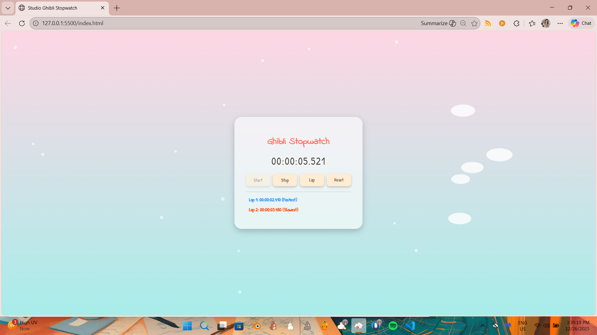

# Studio Ghibli Stopwatch

A whimsical, visually appealing stopwatch inspired by **Studio Ghibli**, featuring animated clouds, floating sparkles, and lap tracking with fastest/slowest highlights. Built with **HTML, CSS, and JavaScript**.

---

## Table of Contents

* [Demo](#demo)
* [Features](#features)
* [Installation](#installation)
* [Usage](#usage)
* [Live Demo](#live-demo)
* [File Structure](#file-structure)
* [Contributing](#contributing)
* [License](#license)

---

## Demo



---

## Features

* **Start / Stop / Reset** stopwatch functionality.
* **Lap tracking** with fastest and slowest lap highlights.
* **Floating clouds** and **sparkles** for a whimsical aesthetic.
* **Responsive design** for desktop and mobile screens.
* Clean, readable code with **separated HTML, CSS, and JS files**.

---

## Installation

1. Clone this repository:

   ```bash
   git clone https://github.com/karenlaureta/stopwatch.git
   ```
2. Navigate to the project directory:

   ```bash
   cd stopwatch
   ```
3. Open `index.html` in your web browser. No server required.

---

## Usage

1. Click **Start** to begin timing.
2. Click **Lap** to record a lap time.
3. Click **Stop** to pause the stopwatch.
4. Click **Reset** to clear the timer and laps.
5. Enjoy animated clouds and sparkles for a relaxing Studio Ghibli feel.

---

## File Structure

```
ghibli-stopwatch/
├── index.html         # Main HTML file
├── style.css          # CSS styles
├── script.js          # JavaScript logic
├── README.md          # Project documentation
└── screenshot.png     # Optional screenshot for README
```

---

## Contributing

Contributions are welcome! You can:

* Add new visual effects or animations.
* Improve mobile performance and responsiveness.
* Refactor JavaScript into modules or classes.

**How to contribute:**

1. Fork the repo.
2. Create a new branch: `git checkout -b feature-name`.
3. Make your changes and commit: `git commit -m "Add feature"`.
4. Push to the branch: `git push origin feature-name`.
5. Submit a pull request.

---

## License

This project is licensed under the **MIT License**.
